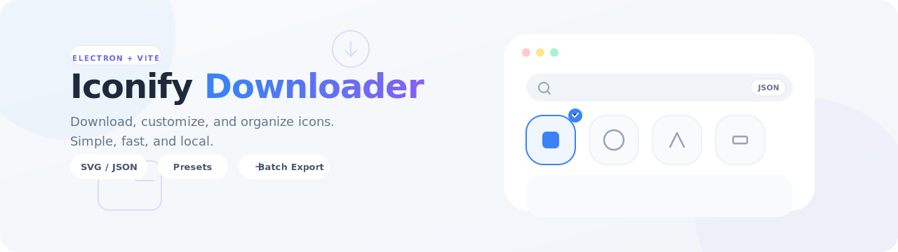

# 


An Electron desktop app + CLI to download Iconify icons, customize SVG output, organize files, and export ZIP bundles.

## Table of Contents
- [Features](#features)
- [Quick Start (Desktop App)](#quick-start-desktop-app)
- [Keyboard Shortcuts](#keyboard-shortcuts)
- [Export Options](#export-options)
- [Collections Grouping (Like Iconify Site)](#collections-grouping-like-iconify-site)
- [CLI](#cli)
- [Development](#development)
- [Roadmap](#roadmap)
- [Contributing](#contributing)
- [Security](#security)
- [License](#license)
- [Acknowledgements](#acknowledgements)

## Features
- Download Iconify icons as:
  - Individual SVG files
  - Iconify-compatible JSON collections
- One-click presets (common export profiles)
- SVG color customization (optional monochrome)
- Organize by prefix (e.g. `mdi/`, `logos/`)
- Optional ZIP export (single bundle per download)
- Download History with one-click re-run + open output folder
- Favorites + show favorites only
- Sorting:
  - Results: API / A–Z / favorites-first
  - Collections: A–Z / by icon count
- Quality of life:
  - Ctrl+K focus search
  - Ctrl+D download selected
  - Ctrl+, open settings
  - Esc close settings

## Quick Start (Desktop App)
### Requirements
- Node.js `20.x`
- pnpm

### Run locally
```bash
pnpm install
pnpm dev
```

### Build (Electron)
```bash
pnpm build
```

## Keyboard Shortcuts
- Ctrl+K: Focus search
- Ctrl+D: Download selected icons
- Ctrl+, : Open settings
- Esc: Close settings

## Export Options
- Subfolder: write output into a subfolder under the selected output directory
- Organize by prefix: create a folder per icon set prefix
- Apply color + Monochrome: colorize SVGs (best for mono icons)
- Export as ZIP: also generate a `.zip` bundle
- ZIP name: custom zip filename (sanitized)

## Collections Grouping (Like Iconify Site)
Collections are grouped in the sidebar into:
- Material
- UI 24px
- UI 16px / 32px
- UI Other / Mixed Grid
- UI Multicolor
- Programming
- Logos
- Emoji
- Flags / Maps
- Thematic
- Archive / Unmaintained

### Mapping file (recommended)
To make grouping deterministic, edit:
- `src/data/collection-groups.json`

Anything not listed in the mapping falls back to heuristic rules based on `prefix`/name.

## CLI
This repository also contains a Node CLI entrypoint:
- Source: `src/cli.ts`
- Build config: `tsup.config.ts`

### Build the CLI/library bundle
```bash
pnpm exec tsup
```

### Run the CLI (after build)
```bash
node dist/cli.cjs --help
```

Example:
```bash
node dist/cli.cjs -i logos:react mdi:github -f svg -o ./icons
```

## Development
### Project structure
- `src/` Renderer (React + Vite)
- `electron/` Electron main + preload + services
- `src/data/collection-groups.json` Collections grouping mapping

### Typecheck
```bash
pnpm exec tsc -p tsconfig.json --noEmit
pnpm exec tsc -p tsconfig.electron.json --noEmit
```

## Roadmap
- Pinned collections (pin favorites to the top)
- Smarter grouping (maintained mapping + optional remote sync)
- Offline cache for fetched SVGs (TTL/LRU)
- Bulk import (paste list/newline/CSV) + validation + missing report
- Duplicate detection (hash-based) + “skip existing” mode
- More export targets (framework components + barrel exports + typings)
- Profiles (per-project saved settings: output dir, presets, naming)
- Pause/Resume/Cancel downloads + per-icon retry
- Naming templates (e.g. `{prefix}/{name}.{ext}`) with sanitization rules
- Export report (JSON/CSV summary: time, count, failures, output paths)

## Contributing
Issues and PRs are welcome.
- Read [CONTRIBUTING.md](CONTRIBUTING.md)
- Keep changes focused and type-safe
- Prefer small, reviewable PRs
- Run typecheck before submitting

## Security
Please review [SECURITY.md](SECURITY.md) for reporting guidelines.

## License
MIT. See `LICENSE` (if present) or `package.json`.

## Acknowledgements
- Powered by [Iconify](https://iconify.design/) collections and APIs.
